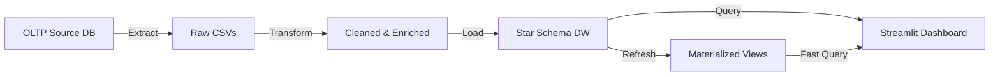
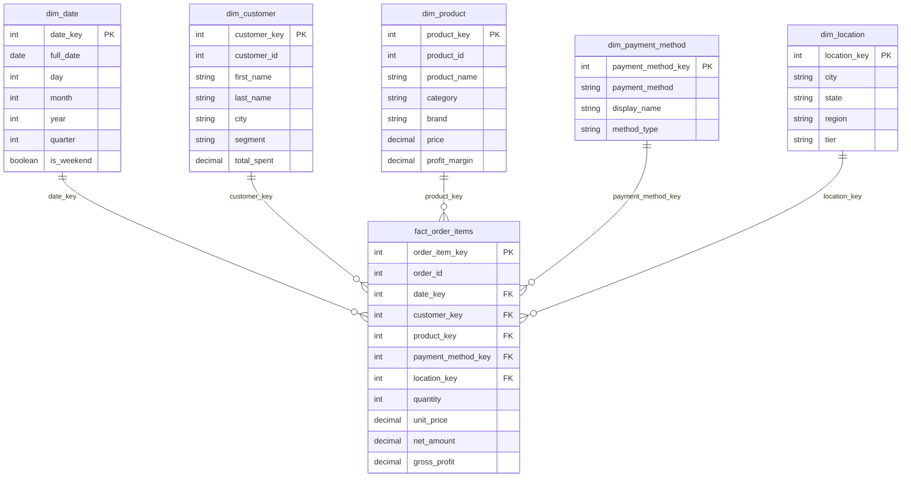

# 🛍️ E-Commerce Data Pipeline with Automated ETL

A production-grade data engineering platform that powers an e-commerce analytics dashboard through a fully automated **Extract → Transform → Load** pipeline. Built with a **star schema** data warehouse, realistic Indian e-commerce data, and an 8-page business intelligence dashboard.


---

## 📋 Table of Contents

- [Architecture Overview](#-architecture-overview)
- [Star Schema Design](#-star-schema-design)
- [Dashboard Pages](#-dashboard-pages)
- [Quick Start](#-quick-start)
- [Project Structure](#-project-structure)
- [Data Dictionary](#-data-dictionary)
- [Configuration](#-configuration)
- [Airflow Scheduling](#-airflow-scheduling)
- [Technology Stack](#-technology-stack)

---

## 🏗 Architecture Overview

```
┌──────────────────────────────────────────────────────────────────┐
│                    E-COMMERCE DATA PLATFORM                     │
├──────────────────────────────────────────────────────────────────┤
│                                                                  │
│   ┌──────────────┐    ┌──────────────┐    ┌──────────────┐      │
│   │  SOURCE OLTP │    │  ETL PIPELINE│    │  DATA        │      │
│   │  (PostgreSQL)│───▶│              │───▶│  WAREHOUSE   │      │
│   │              │    │  Extract     │    │  (Star Schema)│     │
│   │  • customers │    │  Transform   │    │              │      │
│   │  • products  │    │  Load        │    │  • dim_date  │      │
│   │  • orders    │    │              │    │  • dim_cust  │      │
│   │  • items     │    │  🕒 Airflow  │    │  • dim_prod  │      │
│   │  • payments  │    │  Scheduled   │    │  • fact_oi   │      │
│   └──────────────┘    └──────────────┘    └──────┬───────┘      │
│                                                   │              │
│                                           ┌───────▼───────┐     │
│                                           │  STREAMLIT    │     │
│                                           │  DASHBOARD    │     │
│                                           │  (8 Pages)    │     │
│                                           │  📊📈👥🔄    │     │
│                                           │  🛒📦💳🧠    │     │
│                                           └───────────────┘     │
└──────────────────────────────────────────────────────────────────┘
```

### Data Flow



---

## ⭐ Star Schema Design

The data warehouse uses a **proper star schema** with clear fact/dimension separation:



### Design Decisions

| Decision | Rationale |
|----------|-----------|
| **Line-item grain fact table** | Enables product-level analytics (basket analysis, category performance) |
| **`dim_payment_method` as conformed dimension** | Only 6 rows — pure descriptor, no transactional data |
| **`dim_location` as separate dimension** | Enables geographic analytics without customer table dependency |
| **Surrogate keys** | Protects against OLTP key changes, enables SCD support |
| **Materialized views** | Pre-aggregated for fast dashboard queries |

---

## 📊 Dashboard Pages

| # | Page | Key Metrics |
|---|------|-------------|
| 1 | **📊 Executive Summary** | Revenue, Profit, Orders, AOV, MoM growth |
| 2 | **📈 Revenue Analytics** | Daily/Weekly/Monthly trends, Weekend vs Weekday, Category margins |
| 3 | **👥 Customer Intelligence** | Segment distribution, CLV histogram, Top 15 by LTV |
| 4 | **🔄 Retention & Churn** | Repeat rate, Monthly actives, Cohort retention heatmap |
| 5 | **🛒 Conversion & Orders** | Order status funnel, Items per order, AOV trend |
| 6 | **📦 Product Performance** | Top products, Category scatter, Brand rankings, Low stock alerts |
| 7 | **💳 Payment Analytics** | Method share (UPI, Card, etc.), Digital vs cash, Success rates |
| 8 | **🧠 Actionable Insights** | Data-driven recommendations for revenue, retention, upgrades |

### Actionable Insights Engine

The dashboard doesn't just show charts — it provides **specific, data-backed recommendations**:

- **"How to Increase Revenue"** — Identifies high-margin categories with low visibility
- **"How to Convert New → Repeat"** — Calculates the revenue impact of improved retention
- **"How to Upgrade Regular → Premium"** — Lists customers near Premium thresholds
- **"Geographic Growth"** — Finds underperforming regions with expansion potential

---

## 🚀 Quick Start

### Prerequisites

- Docker & Docker Compose v2+
- 4 GB RAM minimum

### One-Command Setup

```bash
# Clone the repo
git clone https://github.com/KomalLaddha-dev/E-Commerce-Data-Pipeline-with-Automated-ETL.git
cd E-Commerce-Data-Pipeline-with-Automated-ETL

# Build and run everything
docker compose up --build
```

This will:
1. Start PostgreSQL 15
2. Create source DB + warehouse DB
3. Generate **2,000 customers, 500 products, 15,000 orders** with realistic Indian data
4. Run the full ETL pipeline (Extract → Transform → Load)
5. Launch the Streamlit dashboard at **http://localhost:8501**

### Manual Steps (Without Docker)

```bash
# 1. Install dependencies
pip install -r requirements.txt

# 2. Set environment variables
export SOURCE_DB_HOST=localhost
export SOURCE_DB_PORT=5433
export DW_HOST=localhost
export DW_PORT=5433
# ... (see Configuration section)

# 3. Setup databases
python scripts/setup_databases.py

# 4. Run ETL pipeline
python scripts/etl_pipeline.py

# 5. Launch dashboard
streamlit run dashboards/app.py
```

---

## 📁 Project Structure

```
E-Commerce-Data-Pipeline/
├── airflow_dags/
│   └── ecommerce_etl_dag.py       # Airflow DAG definition
├── config/
│   ├── database.yaml               # Database connection config
│   └── pipeline_config.yaml        # ETL pipeline settings
├── dashboards/
│   └── app.py                      # Streamlit dashboard (8 pages)
├── data/
│   ├── raw/                         # Extracted CSVs (staging)
│   └── processed/                   # Transformed CSVs (ready to load)
├── logs/                            # Pipeline execution logs
├── scripts/
│   ├── extract.py                   # Data extraction module
│   ├── transform.py                 # Data transformation module
│   ├── load.py                      # Data loading module
│   ├── etl_pipeline.py              # Pipeline orchestrator
│   ├── generate_large_data.py       # Realistic data generator
│   └── setup_databases.py           # Database initialization
├── warehouse_schema/
│   ├── source_schema.sql            # OLTP schema definition
│   ├── warehouse_schema.sql         # Star schema (canonical)
│   ├── warehouse_docker.sql         # Star schema (Docker-adapted)
│   └── analytics_queries.sql        # Business intelligence queries
├── docker-compose.yml               # Multi-service orchestration
├── Dockerfile                       # ETL pipeline image
├── Dockerfile.dashboard             # Dashboard image
├── requirements.txt                 # Python dependencies
├── ppt.md                           # Project presentation slides
└── README.md                        # This file
```

---

## 📖 Data Dictionary

### Fact Table: `fact_order_items`

| Column | Type | Description |
|--------|------|-------------|
| `order_item_key` | SERIAL PK | Surrogate key |
| `order_id` | INT | Degenerate dimension (order ID) |
| `date_key` | INT FK | → dim_date |
| `customer_key` | INT FK | → dim_customer |
| `product_key` | INT FK | → dim_product |
| `payment_method_key` | INT FK | → dim_payment_method |
| `location_key` | INT FK | → dim_location |
| `quantity` | INT | Units purchased |
| `unit_price` | DECIMAL | Price per unit (₹) |
| `line_total` | DECIMAL | qty × price - discount |
| `net_amount` | DECIMAL | Final amount after all adjustments |
| `cost_amount` | DECIMAL | Cost of goods sold |
| `gross_profit` | DECIMAL | net_amount - cost_amount |

### Dimension Tables

| Table | Rows | Key Columns |
|-------|------|-------------|
| `dim_date` | ~1,461 | full_date, year, quarter, is_weekend |
| `dim_customer` | ~2,000 | name, city, segment (Premium/Regular/New) |
| `dim_product` | ~500 | name, category, brand, profit_margin |
| `dim_payment_method` | 6 | credit_card, debit_card, upi, net_banking, wallet, cod |
| `dim_location` | ~40 | city, state, region (North/South/East/West), tier |

---

## ⚙️ Configuration

### Environment Variables

| Variable | Default | Description |
|----------|---------|-------------|
| `SOURCE_DB_HOST` | localhost | Source database host |
| `SOURCE_DB_PORT` | 5433 | Source database port |
| `SOURCE_DB_USER` | etl_user | Source database user |
| `SOURCE_DB_PASSWORD` | etl_password | Source database password |
| `DW_HOST` | localhost | Warehouse host |
| `DW_PORT` | 5433 | Warehouse port |
| `LARGE_DATA_CUSTOMERS` | 2000 | Target customer count |
| `LARGE_DATA_PRODUCTS` | 500 | Target product count |
| `LARGE_DATA_ORDERS` | 15000 | Target order count |

---

## 🕒 Airflow Scheduling

The ETL pipeline is designed to run on a daily schedule via Apache Airflow:

```
Daily at 02:00 UTC
start → extract → transform → load → quality_checks → refresh_views → end
                                                                       ↗
                            [any task fails] → notify_failure ─────────
```

Quality checks validate:
- ✅ All tables are non-empty
- ✅ No null foreign keys in fact table
- ✅ No negative monetary amounts
- ✅ Referential integrity between facts and dimensions

---

## 🛠 Technology Stack

| Component | Technology |
|-----------|------------|
| **Language** | Python 3.11 |
| **Database** | PostgreSQL 15 |
| **ETL** | pandas, SQLAlchemy |
| **Orchestration** | Apache Airflow |
| **Dashboard** | Streamlit + Plotly |
| **Infrastructure** | Docker Compose |
| **Data Model** | Star Schema (Kimball) |

---

## 📄 License

This project is open-source and available under the MIT License.
